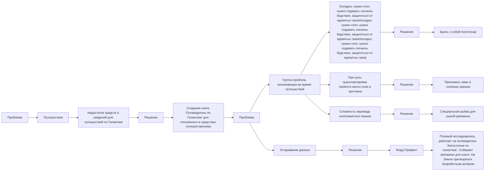

```mermaid
flowchart LR
    Problems[Проблема]-->TripGroup[Путешествия]
    TripGroup-->TripGroupProblem1[Недостаток средств и сведений для путешествий по Галактике]
      TripGroupProblem1-->TGP1Solution[Решение]
        TGP1Solution-->TGP1SDescription[Создание книги 'Путеводитель по Галактике' для стеснённого в средствах путешественника]
          TGP1SDescription-->TGP1SDProblem[Проблема]
            TGP1SDProblem-->TGP1SDPGroup[Группа проблем, возникающих во время путешествий]
              TGP1SDPGroup-->TGP1SDPGProblem1[Холодно, нужен плот, нужно подавать сигналы бедствия, защититься от ядовитых газовХолодно, нужен плот, нужно подавать сигналы бедствия, защититься от ядовитых газовХолодно, нужен плот, нужно подавать сигналы бедствия, защититься от ядовитых газов]
                TGP1SDPGProblem1-->TGP1SDPGP1Solution[Решение]
                  TGP1SDPGP1Solution-->TGP1SDPGP1SDescription[Брать с собой полотенце]
              TGP1SDPGroup-->TGP1SDPGProblem2[При нуль-транспортировке теряется много соли и протеина]
                TGP1SDPGProblem2-->TGP1SDPGP2Solution[Решение]
                  TGP1SDPGP2Solution-->TGP1SDPGP2SDescription[Принимать пиво и солёные орешки]
              TGP1SDPGroup-->TGP1SDPGProblem3[Сложность перевода инопланетных языков]
                TGP1SDPGProblem3-->TGP1SDPGP3Solution[Решение]
                    TGP1SDPGP3Solution-->TGP1SDPGP3SDescription[Специальная рыбка для ушной раковины]
            TGP1SDProblem-->TGP1SDPObsolescense[Устаревание данных]
              TGP1SDPObsolescense-->TGP1SDPOSolution[Решение]
                TGP1SDPOSolution-->TGP1SDPOSDecription[Форд Префект]
                  TGP1SDPOSDecription-->TGP1SDPOSDSubDescription[Полевой исследователь, работает на путеводитель 'Автостопом по галактике'. Собирает материал для книги. На Земле притворялся безработным актёром]

```
