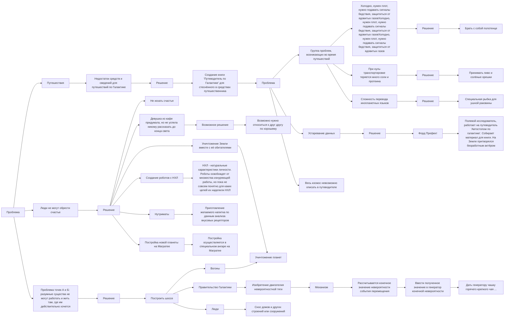

```mermaid
flowchart LR
    Problems[Проблема]-->TripGroup[Путешествия]
    TripGroup-->TripGroupProblem1[Недостаток средств и сведений для путешествий по Галактике]
      TripGroupProblem1-->TGP1Solution[Решение]
        TGP1Solution-->TGP1SDescription[Создание книги 'Путеводитель по Галактике' для стеснённого в средствах путешественника]
          TGP1SDescription-->TGP1SDProblem[Проблема]
            TGP1SDProblem-->TGP1SDPGroup[Группа проблем, возникающих во время путешествий]
              TGP1SDPGroup-->TGP1SDPGProblem1[Холодно, нужен плот, нужно подавать сигналы бедствия, защититься от ядовитых газовХолодно, нужен плот, нужно подавать сигналы бедствия, защититься от ядовитых газовХолодно, нужен плот, нужно подавать сигналы бедствия, защититься от ядовитых газов]
                TGP1SDPGProblem1-->TGP1SDPGP1Solution[Решение]
                  TGP1SDPGP1Solution-->TGP1SDPGP1SDescription[Брать с собой полотенце]
              TGP1SDPGroup-->TGP1SDPGProblem2[При нуль-транспортировке теряется много соли и протеина]
                TGP1SDPGProblem2-->TGP1SDPGP2Solution[Решение]
                  TGP1SDPGP2Solution-->TGP1SDPGP2SDescription[Принимать пиво и солёные орешки]
              TGP1SDPGroup-->TGP1SDPGProblem3[Сложность перевода инопланетных языков]
                TGP1SDPGProblem3-->TGP1SDPGP3Solution[Решение]
                    TGP1SDPGP3Solution-->TGP1SDPGP3SDescription[Специальная рыбка для ушной раковины]
            TGP1SDProblem-->TGP1SDPObsolescense[Устаревание данных]
              TGP1SDPObsolescense-->TGP1SDPOSolution[Решение]
                TGP1SDPOSolution-->TGP1SDPOSDecription[Форд Префект]
                  TGP1SDPOSDecription-->TGP1SDPOSDSubDescription[Полевой исследователь, работает на путеводитель 'Автостопом по галактике'. Собирает материал для книги. На Земле притворялся
безработным актёром]
            TGP1SDProblem-->TGP1SDPBigData["Весь космос невозможно описать в путеводителе"]
    Problems-->Problem2[Люди не могут обрести счастье]
        Problem2-->P2Solution[Решение]
            P2Solution-->P2SVariant1[Не искать счастья]
            P2Solution-->P2SVariant2[Девушка из кафе придумала, но не успела никому рассказать до конца света]
                P2SVariant2-->P2SV2Solution[Возможное решение]
                    P2SV2Solution-->P2SV2SDescription[Возможно нужно относиться к друг другу по хорошему]
            P2Solution-->P2SVariant3[Уничтожение Земли вместе с её обитателями]
            P2Solution-->P2SVariant4["Создание роботов с НХЛ"]
                P2SVariant4-->P2SV4Description["НХЛ - натуральные характеристики личности. Роботы освобождят от множества изнуряющей работы, но пока не совсем понятно для каких целей их наделили НХЛ"]
            P2Solution-->P2SVariant5["Нутриматы"]
                P2SVariant5-->P2SV5Description["Приготовление желаемого напитка по данным анализа вкусовых рецепторов"]
            P2Solution-->P2SVariant6["Постройка новой планеты на Магратее"]
                P2SVariant6-->P2SV6Description["Постройка осуществляется в специальном ангаре на Магратее"]
    Problems-->Problem3[Проблема точек А и Б: разумные существа не могут работать и жить там, где им действительно хочется]
        Problem3-->Problem3Solution[Решение]
            Problem3Solution-->Problem3SMain[Построить шоссе]
                Problem3SMain-->Problem3SMSubject1[Вогоны]
                    Problem3SMSubject1-->Problem3SMS1Solution[Уничтожение планет]
                        P2SVariant3-->Problem3SMS1Solution
                Problem3SMain-->Problem3SMSubject2[Правительство Галактики]
                    Problem3SMSubject2-->Problem3SMS2Solution["Изобретение двигателия невероятностной тяги"]
                       Problem3SMS2Solution-->Problem3SMS2SDescription["Механизм"]
                            Problem3SMS2SDescription-->Problem3SMS2SDChain1["Рассчитывается конечное значение невероятности события перемещения"]
                                Problem3SMS2SDChain1-->Problem3SMS2SDChain2["Ввести полученное значение в генератор конечной невероятности"]
                                    Problem3SMS2SDChain2-->Problem3SMS2SDChain3["Дать генератору чашку горячего крепкого чая ..."]
                Problem3SMain-->Problem3SMSubject3[Люди]
                    Problem3SMSubject3-->Problem3SMS3Solution[Снос домов и других строений или сооружений]
```
